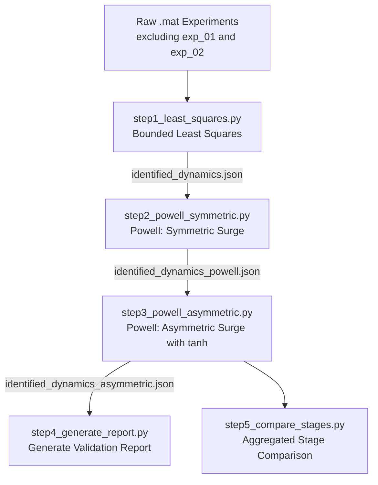

# USV Iacquabot Parameter Identification Methodology

This document outlines the sequential parameter identification pipeline developed to calibrate the 3-DOF Fossen hydrodynamic model for the *iacquabot* USV.

---

## Identification Pipeline Overview

The identification process consists of a sequence of numbered steps, where each step refines the results of the previous one:

---

## Model Mathematical & Physical Structure

The vehicle's dynamics are modeled using Fossen's horizontal plane 3-DOF model ($\nu = [u, v, r]^T$ representing surge velocity, sway velocity, and yaw rate):

$$M \dot{\nu} + C(\nu)\nu + D(\nu)\nu = \tau$$

Where:
* **Inertia Matrix ($M$):** Assumed diagonal due to hull symmetry:
  $$M = \begin{bmatrix} m_{11} & 0 & 0 \\ 0 & m_{22} & 0 \\ 0 & 0 & m_{33} \end{bmatrix}$$
* **Coriolis Matrix ($C$):** Derived directly from $M$:
  $$C(\nu) = \begin{bmatrix} 0 & 0 & -m_{22} v \\ 0 & 0 & m_{11} u \\ m_{22} v & -m_{11} u & 0 \end{bmatrix}$$
* **Damping and Interaction Forces ($D(\nu)\nu$):** Modeled as $[d_u, d_v, d_r]^T$:
  * $d_u = X_u u + X_{uu} |u| u$
  * $d_v = Y_v v + Y_{vv} |v| v + Y_{vr} |r| v + Y_r r + Y_{rv} |v| r + Y_{rr} |r| r + Y_{ur} u r$
  * $d_r = N_v v + N_{vv} |v| v + N_{vr} |r| v + N_r r + N_{rv} |v| r + N_{rr} |r| r$
* **Control Forces ($\tau$):** Provided by the thrusters, $\tau = [T_u, 0, T_r]^T$ (sway is unactuated).

---

## Detailed Pipeline Steps

### Step 1: `step1_least_squares.py` (Bounded Least Squares Initialization)
* **Model Structure:** **Symmetric & Complete (18 parameters)**.
* **Objective:** Obtain an initial global estimate of all 18 parameters.
* **Methodology:**
  1. Filter measured velocities using a Savitzky-Golay filter.
  2. Compute numerical accelerations ($\dot{u}, \dot{v}, \dot{r}$).
  3. Map thruster commands to actual thrust forces.
  4. Build a global regression matrix and solve via **Bounded Least Squares** to ensure physically meaningful bounds.
* **Primary Output:** `identified_dynamics.json` and `iacquabot_identified_params.py`.

---

### Step 2: `step2_powell_symmetric.py` (Symmetric Surge Refinement)
* **Model Structure:** **Symmetric Surge, Multi-ODE Coupled**.
* **Objective:** Refine surge inertia ($m_{11}$) and damping ($X_u, X_{uu}$) using Output-Error minimization.
* **Methodology:**
  1. Lock sway and yaw parameters to Step 1 values.
  2. Optimize $m_{11}$, $X_u$, and $X_{uu}$ using the gradient-free **Powell** algorithm.
  3. Minimize the normalized mean squared error (NMSE) of simulated vs. measured surge velocity.
* **Primary Output:** `identified_dynamics_powell.json` and `iacquabot_powell_identified_params.py`.

---

### Step 3: `step3_powell_asymmetric.py` (Asymmetric Surge Damping)
* **Model Structure:** **Asymmetric Surge, Multi-ODE Coupled**.
  $$\dot{u} = \frac{T_u + m_{22} v r - X_u(u) u - X_{uu}(u) |u| u}{m_{11}}$$
  To avoid numerical discontinuities, a smooth sigmoid transition is implemented via tanh:
  $$\sigma(u) = \frac{1}{2} \left(1 + \tanh(20.0 \cdot u)\right)$$
  $$X_u(u) = X_{u\_neg} + (X_{u\_pos} - X_{u\_neg}) \cdot \sigma(u)$$
  $$X_{uu}(u) = X_{uu\_neg} + (X_{uu\_pos} - X_{uu\_neg}) \cdot \sigma(u)$$
* **Objective:** Calibrate asymmetric surge damping coefficients to capture differences between forward thrust and reverse thrust.
* **Methodology:**
  1. Fix $m_{11}$ and all sway/yaw parameters.
  2. Optimize 4 asymmetric surge variables ($X_{u\_pos}, X_{uu\_pos}, X_{u\_neg}, X_{uu\_neg}$) using **Powell**.
* **Primary Output:** `identified_dynamics_asymmetric.json` and `iacquabot_asymmetric_identified_params.py`.

---

### Step 4: `step4_generate_report.py` (Validation PDF Generation)
* **Objective:** Run validation simulations and compile individual test performance.
* **Output:** `experiment_asymmetric_validation.pdf` and metrics summary in `experiment_asymmetric_validation_metrics.json`.

---

### Step 5: `step5_compare_stages.py` (Aggregated Comparative Report)
* **Objective:** Generate a consolidated PDF report (`stage_comparison_report.pdf`) that visualizes the performance across all three stages (Least Squares, Powell Symmetric, Powell Asymmetric) side-by-side with error metrics for each channel.
